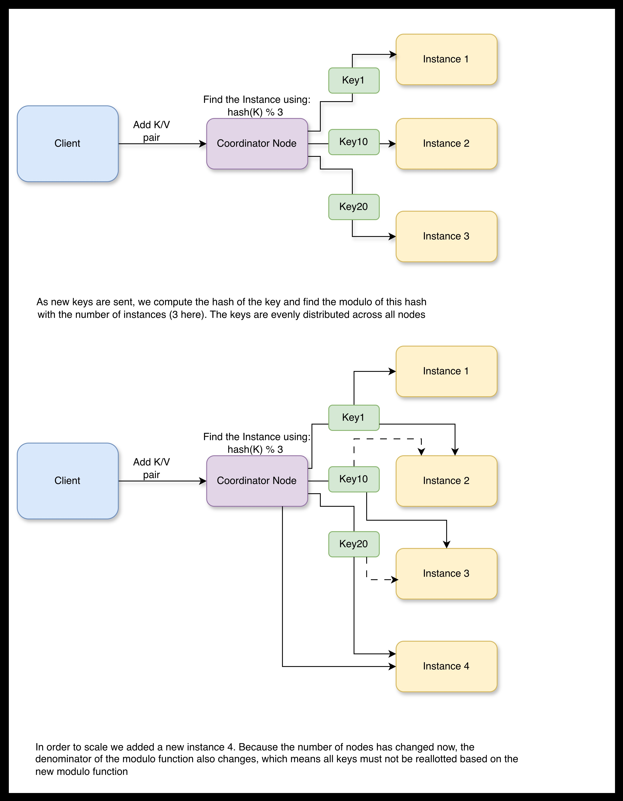
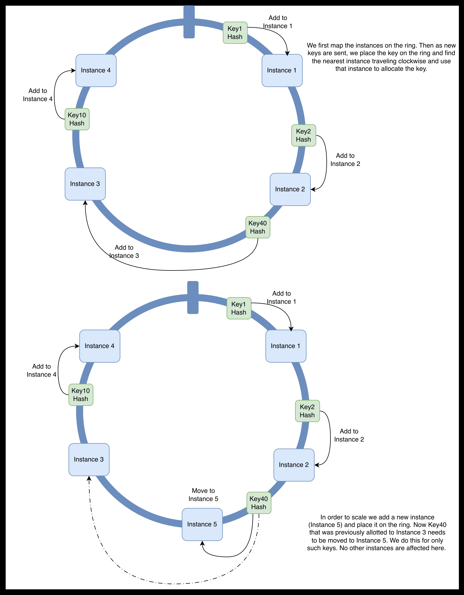
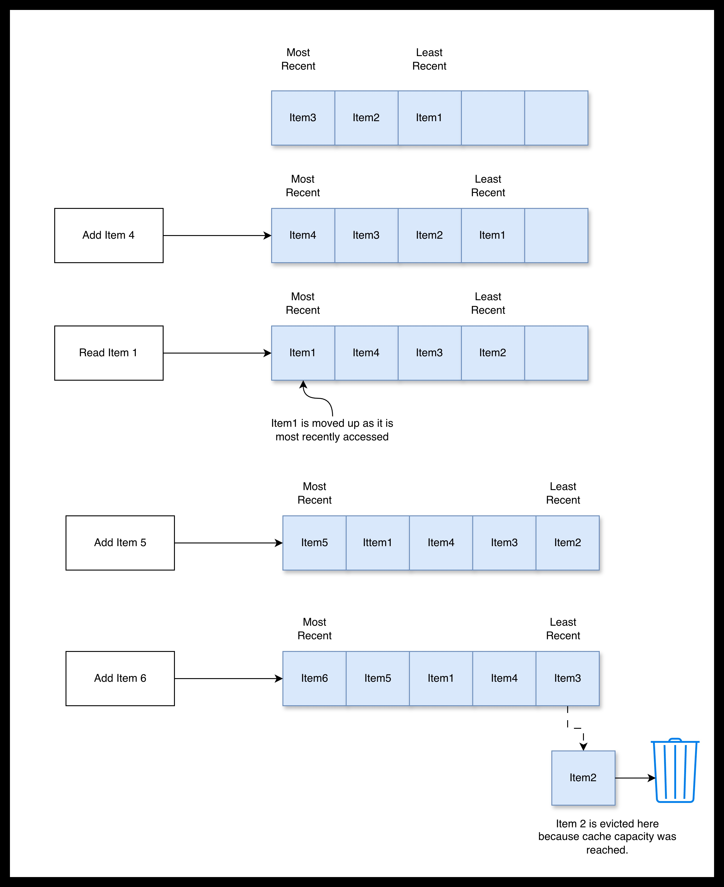

# Consistent Hashing with LRU Cache

This simple project implements Consistent Hashing with one or more nodes (and associated virtual nodes). Each Virtual node is an instance of an LRU Cache (Least Recently used).

I'm jumping the gun here. Here's a quick dump on Consistent Hashing and LRU Caches.

## Consistent Hashing

Consistent Hashing is an algorithm/technique that efficiently redestributes data when adding or removing an instance in a distributed system. 

We could use a simple module function to assign keys to a specific cache instance using the formula: $hash(key) % N $(where N is the number of instances). This works perfectly as long as we don't add/remove any instances from the distributed setup. Adding/Removing instances will result in a reallocation of most keys across instances, which is a costly overhead. 



Consistent Hashing overcomes this issue by using a hash ring, a circular ring where instances are placed based on a hash function. When a key is to be allotted to an instance on the ring, the hash of the key is computed (using the same hash function as used for the instances) and we find the nearest instance based on the hash going clockwise (or the next nearest node with a hash key greater than the key's hash). If the hash of the key is greater than the last node on the ring, we allocate the key to the first node on the ring (hence the ring). 

When a new instance is added or removed, we simply place the instance on the ring and only the keys that were previously allotted to a nearby instance, but belong to the new instance based on its placement are reallotted to the new instance. None of the other instances are affected.



There is excdllent material on the web that explains Consistent Hashing in great detail.


## LRU Cache

Here we use a common type of Cache called the Least-recently-used Cache. The Least-recently-used (or LRU) specifies the eviction policy used to remove items when the the cache capacity is reached. In this type of cache, in the event that the capacity is reached and space needs to be made for new items, we remove the item that was least recently accessed. Access is determined based on how recently an item on the cache was added/updated or read. 



## Setup

### Prerequisites

**Note:** This setup is specifically written for and tested on a MAC, but will work with appropriate updates for Windows/Linux as well. I will leave that to you. 

## 1. Install Docker

I use docker to deploy multiple instances of the LRU cache and manage them through consistent hashing. 
On MAC, install Docker Desktop using this link: https://docs.docker.com/desktop/setup/install/mac-install/

Once installed, run the Docker Desktop app. This will also start the docker process.

## 2. Install python3 and necessary packages

This code is written in python. Download and install the latest stable version of python3.
Install the following packages using pip3:

*docker, 
flask*

## 3. Update Environmental variables

The following environmental variables should be specified as required:

**CACHE_SIZE**: This sets the size of the Cache for each of the Cache Nodes. Defaulted to 3.

***SERVERS***: Comma separated list of servers that are part of the consistent hash ring. Defaulted to 'server1,server2'

***REPLICATION_FACTOR***: The replication factor determines how many virtual nodes are to be added. Specifying a value of 2 would mean one Server instance + one Virtual node instance. Virtual modes are used to uniformly distribute the load on one server. Defaulted to 2.

***RUN_MODE_LOCAL***: The Consistent Hashing Ring runs in two modes: Local and Dockerized Container. Set this to 'True' or 'False' to toggle between the two. Defaulted to 'True'.


## 4. Build the docker container for the Cache

On the Terminal, navigate to the cache directory and run the following command:
```console
docker build --no-cache -t lru_cache_node:latest .
```
This will genarate a docker image. You can see this in docker desktop as *lru_cache_node* in the Images tab.

## 5. Testing

Now you are ready to test! There are two ways to test consistent hashing

### Option 1: Local Python testing

Use this if you want to test this locally. Here each Cache instance is a python class and the entire Consistent Hashing Ring runs within one Python program. To execute this navigate to the parent directory of this project and run the following on the command line:
```console
export RUN_MODE_LOCAL='True' 
python3 RingAPIInvocation.py
```

This will start the Consistent Hash Ring as a flask server on port 6000. By default cache nodes are created based on the values of the environmental variables specified above. For instance if the *SERVERS* value is set to 'serverA, serverB' with *REPLICATION_FACTOR* set to 2, 2 instances of cache will be created with 4 virtual nodes spread across the hash ring (2 virtual nodes per cache).

You can now invoke underlying APIs to test the consitent hash ring. See Appendix for the list of available APIs.

There are two logs of interest: *consistent_hashing.log* and *lru_cache.log*. You can tail both logs to follow how the cache instances and virtual nodes are created, their hash values and how cache entries are assigned to these nodes. 

### Option 2: Testing wih docker containerized Cache nodes

Use this if you want to test this using dockerized cache nodes. To execute this navigate to the parent directory of this project and run the following on the command line:
```console
export RUN_MODE_LOCAL='False' 
python3 RingAPIInvocation.py
```

This will start the Consistent Hash Ring as a flask server on port 6000. By default cache nodes are created based on the values of the environmental variables specified above. For instance if the *SERVERS* value is set to 'serverA, serverB' with *REPLICATION_FACTOR* set to 2, 2 instances of cache will be created with 4 virtual nodes spread across the hash ring (2 virtual nodes per cache).
On the Docker Desktop you can see the created server instances  under the Containers tab with the prefix *lru-cache-*. 

You can now invoke underlying APIs to test the consitent hash ring. See Appendix for the list of available APIs.

There are two logs of interest: *consistent_hashing.log* and *lru_cache.log*. You can tail the former on the command line. To tail the latter run the following comamnd:
```console
docker exec -it <Docker Container Name> tail -f /pyapp/lru_cache.log
```
Replace *Docker Container Name* with the appropriate container name with the prefix *lru-cache-*.

## Appendix: List of APIs

I use curl here, but you can run these tests in a tool like Postman too.

### Server related APIs:

These APIs would typically be used by an administrator or by a monitoring process/service to control the creation/deletion of servers/nodes. 

1. /add_server [POST]: API to add new servers to the Consistent Hash Ring. Note: The code does not currently reallocate cache entries based on the newly added cache node. I will fix this in the next iteration.

Usage: 
```console
curl 0.0.0.0:6000/add_server -H "Content-Type: application/json " -d '{"server": "<Server_Name>"}'
```
Replace *Server_Name* with a unique value. If running in dockerlized mode, you should see a new container instance showing up in Docker Desktop.


2. /remove_server [POST]: API to add new servers to the Consistent Hash Ring. Note: The code does not currently reallocate cache entries based on the deleted cache node. I will fix this in the next iteration.

Usage: 
```console
curl 0.0.0.0:6000/remove_server -H "Content-Type: application/json " -d '{"server": "<Server_Name>"}'
```
Replace *Server_Name* with a unique value. If running in dockerlized mode, you should see a new container instance showing up in Docker Desktop.

3. /get_servers [GET]: API to get a list of all the servers and their associated virtual nodes and hash values.

Usage:
```console
curl 0.0.0.0:6000/get_servers
```
### Cache related APIs:

These APIs are used by the client to add and retrieve entries from the caches on the consistent hash ring. The API handles the addition and retrieval from the right cache node based on the consistent hashing algorithm.

1. /put_cache_entry [POST]: API to add/update a cache entry.

Usage: 
```console
curl 0.0.0.0:6000/put_cache_entry -H "Content-Type: application/json " -d '{"key":"<key>", "value":"<value>"}'
```
Replace *key* and *value* with the right values. 

2. /get_cache_entry/<key> [GET]: API to retrieve the value of a cache entry.

Usage: 
```console
curl 0.0.0.0:6000/get_cache_entry/<key> 
```
Replace *key* with the right value. 


