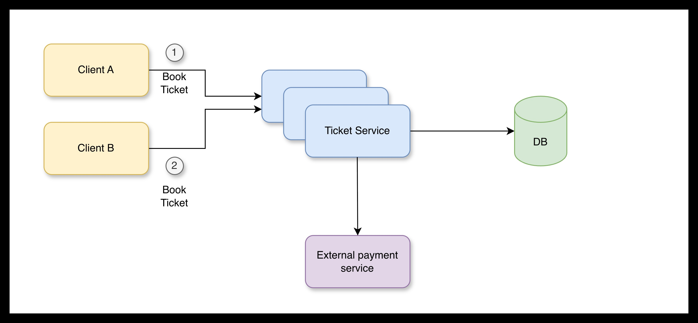
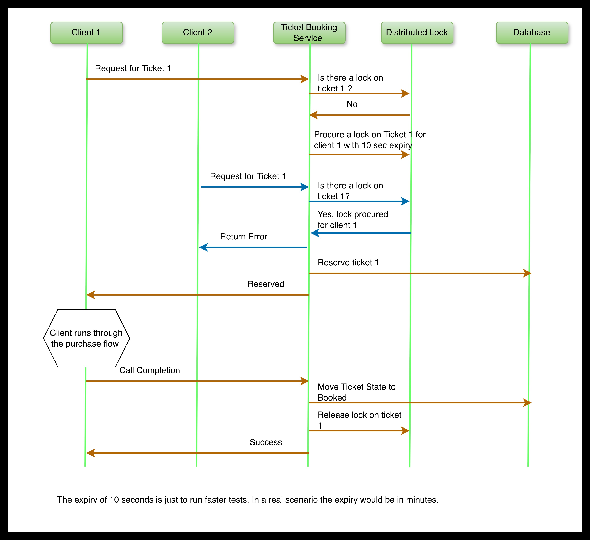
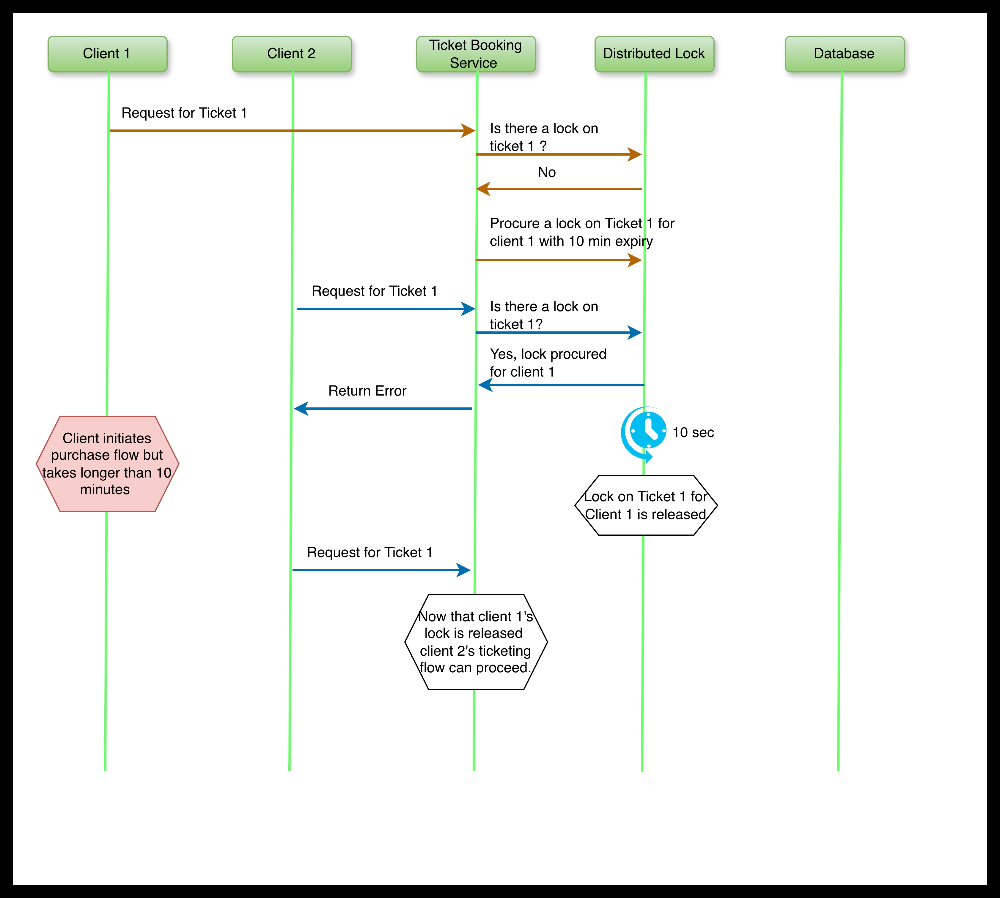

# Distributed Locks

This is a small implementation demonstrating the use of Distributed Locks that effectively control access to shared resources in Distributed Systems.

## Why Distributed Locks?

In a Distributed System, for a shared resources in a database requires tight coordination to avoid unintended updates. For instance, in the example below:



Consider a Ticketing service that allows its customers to order tickets to certain events. The tickets are maintained in a simple relational database and an external payment service is used to make payments. The ticketing service is horizontally scaled to support the volume of customers of the service. Now during the booking window of a very popular event, Client A and Client B are both simultaneously trying to buy a ticket to the event. Client A and B both login to the ticketing application and see that there's exactly one ticket available. Client A selects that ticket and proceeds to enter address and payment details. At the same time Client B also selects the same ticket and proceeds to enter eddress and payment details. Client A completes payment and procures the ticket. Now depending on the backend implementation, Client B might be allowed to also make the payment and receive a confirmation, resulting in a double booking, or Client B might see an error at the very end. If there were 2 available tickets instead of 1, Client B may have then missed the chance to procure the second ticket because she was in the middle of the data entry process. 

A simple fix could be to add a row level lock in the database when Client A selects the ticket and starts the booking process. Now when Client B now tries to start booking the same ticket, an error is reported, preventing the booking from proceeding, possibly saving the client the unnecessary pain of entering additional details before seeing the error. There's a problem with this approach though. Row level DB locks are typically designed for short durations. Also consider the case where Client A procured a lock on that row, but crashed before completing the transaction and releasing the lock. Then the ticket is perpectually locked and Client B can no longer book the ticket even though its avaialable. In such a scenario some cleanup process would be needed to run (possibly scheduled to run periodically) to release this transaction. This adds unnecessary delay. 

A more elegant solution is to use Distributed Locks. Distributed locks are designed to be long running and be released if the owner of the lock crashes or times out before expiry. Two popular distributed lock implementations are in Redis and Zookeeper.

## Redis

Redis distributed locks are keys with an expiry time that individual instances of the ticketing application can create/acquire and delete once they are done with their transaction. Another instance of the service trying to access the same resource will first check for the presence of the lock, and if found will terminate their process. The expiry ensures that the lock is automatically removed on expiry and in the event that the owner of the lock crashes/times out, other servers trying acquire the same resource can now do so. Redis being single threaded ensures that requests are executed sequentially and in the order they are received. 

## Zookeeper

Zookeeper locks work a little differently. To acquire a lock, servers create an ephemeral node under the key for which they are trying to acquire a lock. The node is assigned a sequence number that is incremental such that the first resource that created the node has a lower sequence number and is therefore considered to be the owner of the lock. Once that owner completes the transaction, the ephemeral node is deleted and the owner of the next lowest sequence becomes the owner of the lock and can proceed. Each owner/server can retrieve all ephemeral nodes for their key/resource and check if its sequence number is the lowest before proceeding. An owner places a watch on the sequence number preceeding their's and they are notified when that ephemeral node is deleted so they can proceed. 

## Setup

In this example implementation we simulate the Ticket booking service (minus the external payment service) with both Redis and Zookeeper like distributed lock implementations. The ticketing service, distributed lock (Redis), ephemeral nodes (Zookeeper) and Postgresql DB are all Docker containers. 

TBD: I intend to deploy the Ticketing service as a Kubernetes service to demonstrate true distributed deployment/horizontal scaling, but for now docker containers will work as well. I will update this Readme section once I've added that support.

### Prerequisites 

Note: This setup is specifically written for and tested on a MAC, but will work with appropriate adjustments for Windows/Linux as well. 

#### 1. Install Docker 

I use docker to deploy the Distributed Lock Service, the Ephemeral Node Service and the Ticketing Service. 
On MAC, install Docker Desktop using this link: https://docs.docker.com/desktop/setup/install/mac-install/

Once installed, run the Docker Desktop app. This will also start the docker process.

#### 2. Install python3 and necessary packages

This code is written in python. Download and install the latest stable version of python3. Install the following packages using pip3:

`docker, flask, psycopg2-binary`

#### 3. Install and run Docker image for Postgresql

For our purpose the default version of Postgresql will suffice. Pull the latest image of Postgresql from Dockerhub and run it as follows:

```console
docker pull postgres

docker run --name postgres-db -e POSTGRES_PASSWORD=mysecretpassword -v postgres-data:/var/lib/postgresql -p 5555:5432 -d postgres
```

In the Docker desktop confirm that the distributed_lock container is running and is listening on port 5555

### Installation

#### 1. Build and run the Docker image for the Distributed Locks

Navigate to the distributed-locks directory. 
Run the following commands:

```console
docker build --no-cache -t distributed_lock:latest .
docker run --name distributed_lock -d -p 6000:6000 distributed_lock:latest
```

In the Docker desktop confirm that the distributed_lock container is running and is listening on port 6000

#### 2. Build and run the Docker Image for the Ephemeral Nodes

Navigate to the ephemeral_nodes directory.
Run the following commands:

```console
docker build --no-cache -t ephemeral_node:latest .
docker run --name ephemeral_node -d -p 6001:6001 ephemeral_node:latest
```

In the Docker desktop confirm that the ephemeral_node container is running and is listening on port 6001

#### 3. Build and run the Docker Image for the Ticketing Service

Mavigate to the ticketing directory.
The ticketing service is set to use the distributed locks by default. 
To use ephemeral nodes, replace the text after the -e option with "LOCK_TYPE=ephemeral_node"


```console
docker build --no-cache -t ticketing_service:latest .
docker run --name ticketing_service -e "LOCK_TYPE=distributed_lock" -d -p 6005:6005 ticketing_service:latest
```

**Note:** To run two ticketing service instances, one with Lock Type as distributed_lock and another with Lock Type ephemeral_node, invoke the docker run command twice but use different names and ports. You will need to update `client/distributed_lock_tester.py` and update the `base_ticketing_url` parameter to reflect the right port.

#### 4. Initialize the Ticketing DB

In the ticketing directory, run the init_ticketing_service.py file. 
Note that this will recreate ticketing entries. So proceed with caution! 

```console
python3 init_ticketing_service.py
```

## Testing

There are 10 tickets available by default. To change this number update the TOTAL_TICKETS variable in the
`ticketing/init_ticketing_service.py file`. 

There are two steps to booking a ticket:
1. **Reserve a ticket:** A customer selects a ticket and proceeds to initiate the ticket purchase process by calling the 'reserve' API. The ticket is now 'reserved' for the customer. A this point the customer enters address and payment details. The user has a limited fixed time to complete the transaction. 
This is where the distributed lock with expiry comes into the picture. The lock has an expiry period, which ensures in the event the customer fails to complete the transaction or if either the client or the backend server terminates, the lock is released and the ticket is made available to other customers.
2. **Book a ticket:** Once payment details are entered and verified, the customer invokes the 'book' API to complete the purchase. This 2 step process allows a customer to complete the whole ticket purchase process with some guarantee that the ticket will not be sold to someone else if the purchase is made within the allowed time period, after which if the purchase is not made, the ticket is released.

To initiate testing, navigate to the client directory.
Run the `distributed_dock_tester.py` file. I've only added the basic tests shown in the figures below. 
Update and test as you need to. 

```python
python3 distributed_lock_tester.py
```

### Scenarios: 

1. Successful Transaction: 



2. Failed Transaction:




## Appendix: List of APIs

I use curl here, but you can run these tests in a tool like Postman too.
I am only listing the Ticketing Service APIs here. 
The Distributed Lock and Ephemeral Node APIs are called and used by the Ticketing Service.

If interested you can find these in `distributed_locks/distributed_lock_api.py and ephemeral_nodes/ephemeral_node_api.py`

1. **/reserve_ticket [POST]:** API to reserve a specific ticket for a customer. This internally calls either the distributed lock/ephemeral node API to acquire a lock on the ticket for the customer. 

Usage:
```console
curl localhost:6005/reserve_ticket -X POST -H "Content-Type: application/json " -d '{"ticket_id": "<Ticket ID>", "client_id": "<Customer's Identifier>"}'
```

Returns HTTP 200 on success and HTTP 400 on failure.

2. **/book_ticket [POST]:** API to book a specific ticket which was previously reserved. The booking fails if the state of the ticket is not reserved or if there is no lock on the ticket for that client.

Usage:
```console
curl localhost:6005/book_ticket -X POST -H "Content-Type: application/json " -d '{"ticket_id": "<Ticket ID>", "client_id": "<Customer's Identifier>"}'
```

Returns HTTP 200 on success and HTTP 400 on failure.

3. **/available_tickets [GET]:** API to retrieve the list of available tickets. Returns a list of available ticket Ids. The Customer can then proceed to choose one ticket from the list and initiate the ticketing process.

Usage:
```console
curl 0.localhost:6005/available_tickets
```

Returns a json with the list of available ticket Ids available using the key `available_tickets`

